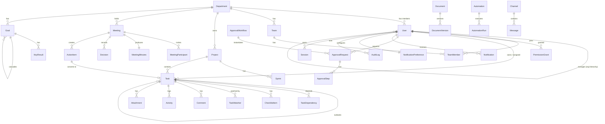

# Sarion OS — Entity Relationship Diagram

## Key relationships & integrity rules

- **Org hierarchy** is self-referential on `User.managerId`; cycles prevented in service layer.
- **One Super Admin**: enforced by unique partial index `WHERE role='SUPER_ADMIN'`.
- **ActionItem ↔ Task** is 1:1 (`ActionItem.taskId @unique`) — converting an action item creates exactly one tracked task.
- **Soft delete** (`deletedAt`) on User, Department, Project, Task, Document; queries filter by default.
- **Dependencies** form a DAG; cycle check before insert into `TaskDependency`.
- **Goal cascade** via `parentGoalId` lets company → dept → team → employee OKRs roll up.
- **Read models**: Tasks, Projects, Documents, Messages projected into Elasticsearch for search/filter; dashboards read from Redis-cached aggregates refreshed by workers + invalidated on writes.
